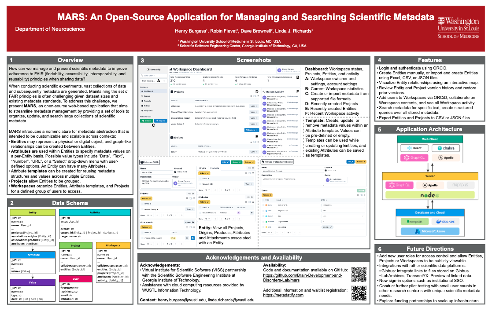

# Metadatify 🧪

> Metadatify, or the Metadata Aggregation for Reproducible Science (MARS) project, is an open-source web-based tool to create, manage, and search scientific metadata.

[](https://doi.org/10.5281/zenodo.13946927) 




## Features

- Rich metadata entry and management, including support for file imports (CSV, JSON files)
- Export partial or complete metadata into multiple different file types (CSV, JSON files)
- Text-based search and advanced query system for searching deeply through metadata
- Manage metadata across projects and share with external users using Workspaces
- Establish relationships between metadata entries, visualize these relationships
- Edit history and version restore for metadata entries
- User accounts handled via [ORCiD](https://orcid.org) sign-in

## Documentation

The [wiki](https://github.com/Brain-Development-and-Disorders-Lab/mars/wiki) is actively maintained that covers the concepts introduced by Metadatify and how to use the platform. Documentation for API usage and self-hosting is coming soon.

## Development

### Install dependencies

1. Install dependencies for the overall project by running `yarn` in the root directory of the repository. These dependencies are required to run `husky` and setup the pre-commit hooks that run `prettier` prior to any git commits.
2. Install dependencies for the client by running `yarn` in the `/client` directory of the repository.
3. Install dependencies for the server by running `yarn` in the `/server` directory of the repository.

### Setup environment variables

Metadatify uses Docker to containerize the server components. Before starting the Docker containers, three environment variables must be configured in an `.env` file that should be placed in the `/server` directory.

The `.env` file must have the following variables:

- `CONNECTION_STRING`: The local MongoDB database connection string, update the username and password.
- `GRAPHQL_PORT`: The port value for the GraphQL endpoint
- `NODE_ENV`: Specify the Node environment

The following variables are only required if deploying with ORCiD authentication, see [ORCiD Developer Tools](https://orcid.org/developer-tools):

- `CLIENT_ID`: Client application ID
- `CLIENT_SECRET`: Client application secret

An example `.env` file is shown below:

```Text
# Database variables
CONNECTION_STRING=mongodb://<username>:<password>@localhost:27017/
GRAPHQL_PORT=8000

# Node environment
NODE_ENV=development

# ORCiD ID API variables
CLIENT_ID=<ORCiD client ID>
CLIENT_SECRET=<ORCiD client secret>
```

### Starting Docker containers

To start a fresh instance of the MongoDB database, use `docker compose`:

```Bash
docker compose up --build
```

This command will build all required containers before starting the containers required by the server. The MongoDB database can be browsed using the `mongo-express` interface accessible at `localhost:8081`.

### Running Metadatify client and server

To start the client, run `yarn start` in the `/client` directory. Start the server by running `yarn build` and then `yarn start` in the `/server` directory. Both the client and server should be running alongside the Docker containers before attempting to access the interface at `localhost:8080`.

## Testing

Metadatify includes Cypress tests and component tests for the client, and the server includes unit tests using Jest.

### Testing - Client

To run component tests, run `yarn test:components` in the `/client` directory.

[Cypress](https://www.cypress.io/) is used for testing the client UI. Before running client tests, add an `.env` file in the `/client` directory with the following variables:

- `CONNECTION_STRING`: The local MongoDB database connection string, update the username and password.

An example `.env` file is shown below:

```Text
# Database variables
CONNECTION_STRING=mongodb://<username>:<password>@localhost:27017/
```

Once the `.env` file has been configured, run `yarn test:ui` in the `/client` directory to run all Cypress tests in headless mode.

To run component tests, run `yarn test` in the `/client` directory. To run Cypress tests, run `yarn cypress run` in the root `/` directory of the repository. Ensure the server is running, otherwise the Cypress tests will fail.

### Testing - Server

> [!WARNING]
> Testing the server will erase the local MongoDB database!

To run unit tests, run `yarn test` in the `/server` directory.

## Acknowledgements

**Organizations:**

- Department of Neuroscience, Washington University School of Medicine in St. Louis
- Brain Development and Disorders Lab, Washington University School of Medicine in St. Louis
- Scientific Software Engineering Center, Georgia Institute of Technology

**Contributors:**

- Henry Burgess
- Robin Fievet
