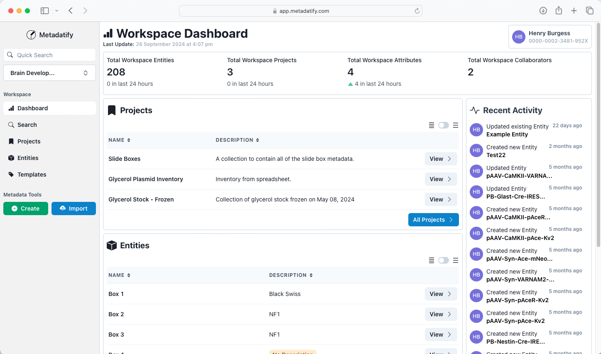
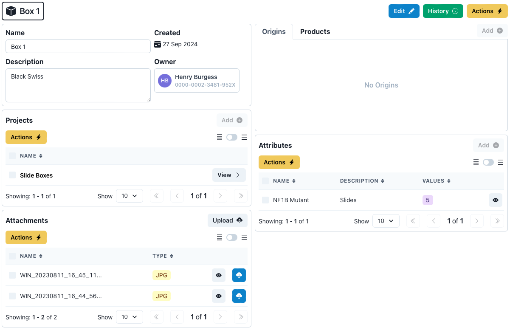
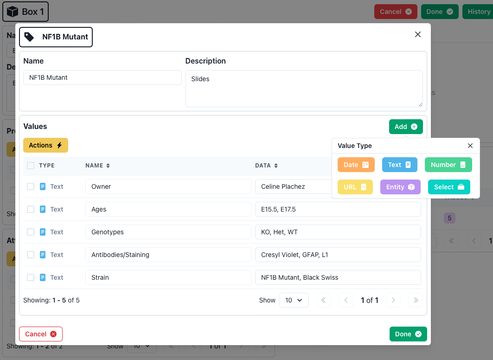

# Metadatify 🧪

> Project Metadata Aggregation for Reproducible Science (MARS) is an open-source web-based tool to create, manage, and search scientific metadata.

[](https://doi.org/10.5281/zenodo.13946927) 



## Features

- Rich metadata entry and management, including support for file imports (CSV, JSON files)
- Export partial or complete metadata into multiple different file types (CSV, JSON files)
- Text-based search and advanced query system for searching deeply through metadata
- Manage metadata across projects and share with external users using Workspaces
- Establish relationships between metadata entries, visualize these relationships
- Edit history and version restore for metadata entries
- User accounts handled via [ORCiD](https://orcid.org) sign-in

## Concepts

### Representing Metadata

#### Entity

> [!NOTE]
> "Entity" refers to the object that the metadata is describing.

Everything is recognized as an "Entity", from physical brain slices to antibodies. Specific metadata values within Entities are organized using "Attributes" (see below), and Attributes contain typed data "Values".

Entities have the following components that are able to be user-defined:

- `name`: This is the identifying name for the Entity. This is not as powerful as an ID and is not required to be unique. MARS uses an ID system behind-the-scenes.
- `owner`: The creator of the Entity, typically assigned to the ORCiD of the user creating the Entity.
- `created`: The date that the Entity came into existence or was created.
- `description`: A text description of the Entity. This should not be used to store concrete metadata. Metadata should be expressed later as Attributes.
- `projects`: The collection of Projects that the Entity is a member of.
- `origins`: The collection of Origin Entities related to this Entity. If this Entity was created from another Entity, the other Entity is the Origin. This is often referred to in other contexts as the "parent".
- `products`: The collection of Product Entities related to this Entity. If this Entity has created other Entities, the other Entities are the Products. These are often referred to in other contexts as "children".
- `attributes`: Attributes are used to specify the Entity metadata values. Attributes are discussed further below.
- `attachments`: Images or PDF files can be attached to Entities.



#### Attribute

> [!TIP]
> All metadata should be expressed using Attributes.

Attributes are the method of organizing Entity metadata. Attributes contain types of metadata stored as key-value pairs known as `values`. Values can be of the following types:

- `string`: A text value of any length.
- `number`: A numerical value.
- `date`: A date or timestamp.
- `url`: A link to external or internal online resource.
- `entity`: A "soft" relation to another Entity. This does not have the significance of an Origin or Product Entity in the overall system but could be used to express a similar concept.
- `select`: A drop-down containing a customizable set of options. The set of options can be customized before and after the value is created.

Template Attributes can be created, to allow metadata structures and values to be reused across Entities.



### Organizing Metadata

#### Projects

Projects are collections of Entities. Entities can be added and removed from Projects. Projects can be used to export large numbers of Entities.

#### Workspaces

A Workspace is a collection of Entities, Attributes, and Projects. Access is managed using the user's ORCiD, and users can be added and removed from Workspace access. Activity is tracked across a Workspace, including modifications made to any Entities, Attributes, and Projects.

Currently, access to a Workspace grants the user access to all Entities, Attributes, and Projects within that Workspace.

## Testing

> [!WARNING]
> Most testing will erase the local MongoDB database!

### Client

To run component tests, run `yarn test:components` in the `/client` directory.

[Cypress](https://www.cypress.io/) is used for testing the client UI. Before running client tests, add an `.env` file in the `/client` directory with the following variables:

- `CONNECTION_STRING`: The local MongoDB database connection string, update the username and password.

An example `.env` file is shown below:

```Text
# Database variables
CONNECTION_STRING=mongodb://<username>:<password>@localhost:27017/
```

Once the `.env` file has been configured, run `yarn test:ui` in the `/client` directory to run all Cypress tests in headless mode.

To run component tests, run `yarn test` in the `/client` directory. To run Cypress tests, run `yarn cypress run` in the root `/` directory of the repository. Ensure the server is running, otherwise the Cypress tests will fail.

### Server

To run unit tests, run `yarn test` in the `/server` directory.

## Deployment

### Specify environment variables

Before starting the Docker containers, three environment variables must be configured in an `.env` file that should be placed in the `/server` directory.

The `.env` file must have the following variables:

- `CONNECTION_STRING`: The local MongoDB database connection string, update the username and password.
- `GRAPHQL_PORT`: The port value for the GraphQL endpoint
- `NODE_ENV`: Specify the Node environment

The following variables are only required if deploying with ORCiD authentication, see [ORCiD Developer Tools](https://orcid.org/developer-tools):

- `CLIENT_ID`: Client application ID
- `CLIENT_SECRET`: Client application secret

An example `.env` file is shown below:

```Text
# Database variables
CONNECTION_STRING=mongodb://<username>:<password>@localhost:27017/
GRAPHQL_PORT=8000

# Node environment
NODE_ENV=development

# ORCiD ID API variables
CLIENT_ID=<ORCiD client ID>
CLIENT_SECRET=<ORCiD client secret>
```

### Starting the Docker containers

To start a fresh instance of the MongoDB database, use `docker compose`:

```Bash
docker compose up --build
```

This command will build all required containers before starting the containers required by the server. The MongoDB database can be browsed using the `mongo-express` interface accessible at `localhost:8081`.

### Starting the MARS client and server

Install all client dependencies by running `yarn` in the `/client` directory. Install all server dependencies by running `yarn` in the `/server` directory.

To start the client, run `yarn start` in the `/client` directory. Start the server by running `yarn build` and `yarn start` in the `/server` directory. Both the client and server should be running alongside the Docker containers before attempting to access the interface at `localhost:8080`.

## Acknowledgements

**Organizations:**

- Department of Neuroscience, Washington University School of Medicine in St. Louis
- Brain Development and Disorders Lab, Washington University School of Medicine in St. Louis
- Scientific Software Engineering Center, Georgia Institute of Technology

**Contributors:**

- Henry Burgess
- Robin Fievet
