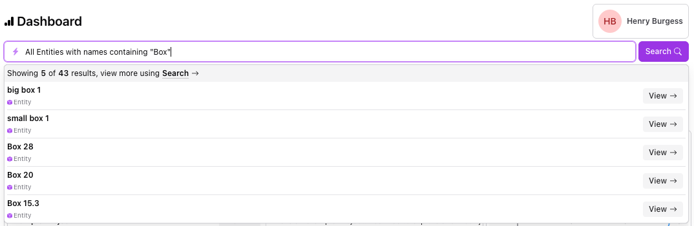
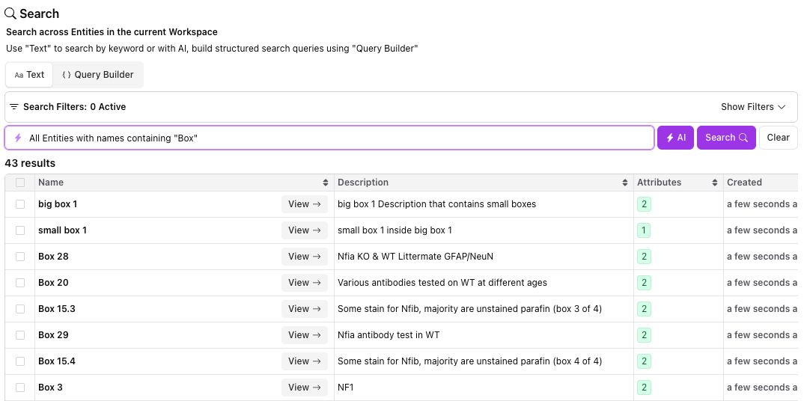
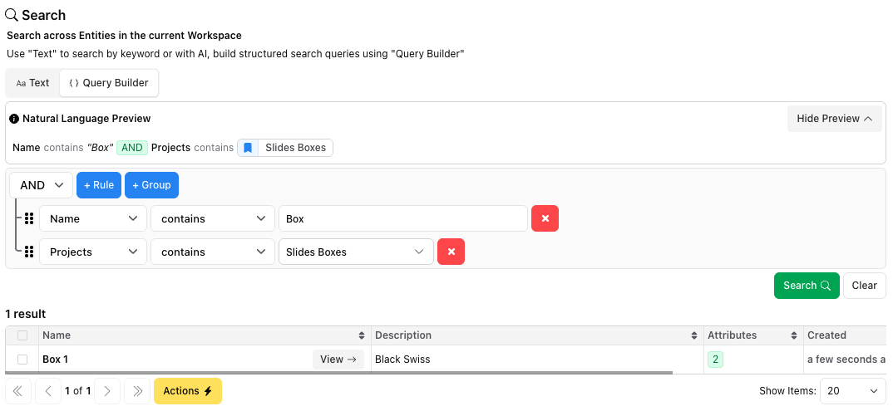
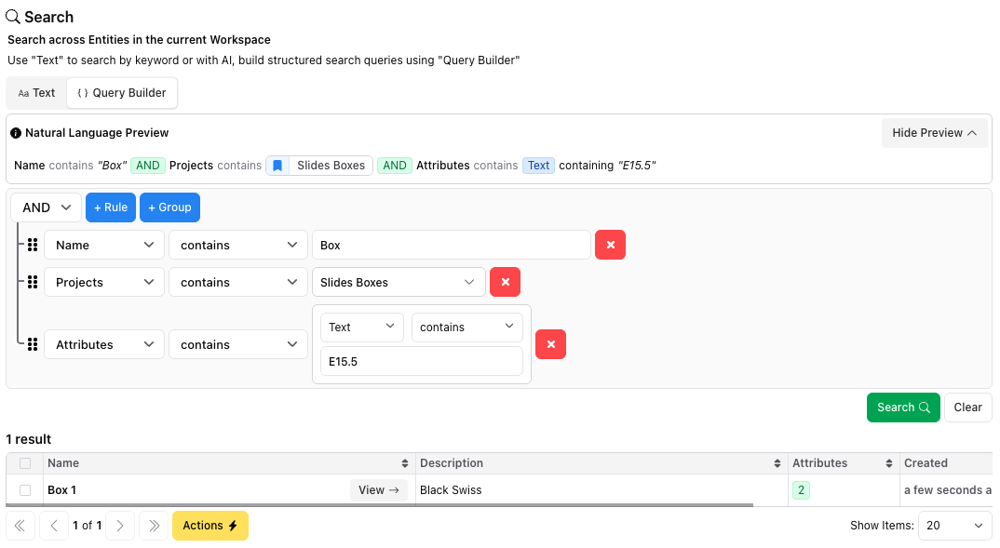

# Searching

There are two ways to search metadata across Metadatify: AI search and advanced query search.

## AI-Assisted Search

There are two methods to perform an AI-assisted text search using Metadatify: the "quick search" navigation element, and the dedicated search page.

### AI-Assisted Quick Search

Metadatify provides a "quick search" bar at the top of the dashboard. It displays a list of the top five best matches to the search query. Links are provided next to each entry to the corresponding Entity, and a link to the full "Search" page is provided at the bottom of the list.



### AI-Assisted Text Search

The first tab on the Search page is a full text search. Without AI-assistance enabled, the search query is entered into the search bar and any results matching text contained anywhere in the Entity are displayed. When AI-assistance is enabled, the natural language query is processed and any relevant results are returned.



Optionally, the user can apply various filters to the search results such as including Entities that have been archived or specifying a date range.

## Advanced Query Search

Where greater specificity is required, Metadatify provides an advanced query builder. Criteria can be added to the query and target Entity fields.



**Groups** of **rules** can be created, and logical relationships such as **AND** and **OR** can be used between groups.

Rules have the following structure:

```text
[Field] [Criteria] [Value]
```

Each rule targets a specific field. When building an advanced query, the following fields can be indexed:

- Name
- Description
- Projects
- Relationships
- Attributes

A preview of the query expressed in natural language is shown above the query structure to aid interpretability.

### Advanced Query Search - Projects

When building a rule involving Projects, the user can select a Project from the value dropdown menu. The rule criteria refers to the Entity's membership in that Project. For example, "contains" means the Entity is a member of the specified Project.

### Advanced Query Search - Relationships

When building a rule involving Relationships, the user can select an Entity from the value dropdown menu. The rule criteria refers to whether the Entity has any relationship to the target Entity. For example, "contains" means that some relationship exists between the result and the specified Entity.

### Advanced Query Search - Attributes

Additional query rules must be created for Attributes. After selecting the "Attributes" field, an additional region will appear to specify the Attribute type, criteria, and value.


