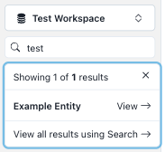
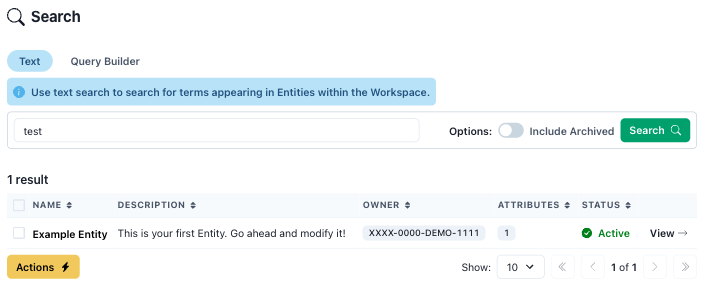
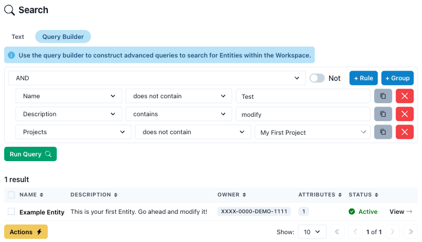

# Searching

There are two primary ways to search for Entities in Metadatify: a text-based search or an advanced query search.

## Text Search

There are two methods to perform a text search using Metadatify, the first method utilizes the "quick search" navigation element, and the second method uses the dedicated search page.

### Quick Text Search

Metadatify provides two locations to perform a basic text-based search of all metadata. A "quick search" bar is located at the top of the left sidebar and will display a list of the top five best matches to the search query. Links are provided next to each entry to the corresponding Entity, and a link to the "Search" page is provided at the bottom of the list.



### Full Text Search

The first tab on the Search page is a full text search. The search query is entered into the search bar and any results matching text contained anywhere in the Entity are displayed. Results are ranked by relevance to the search query:

1. Exact or case-insensitive match to Entity name
2. Entity description contains text
3. Entity Attributes contain text



Optionally, the user can include archived Entities in the search results. The archive status of the Entity is displayed with the Entity in the search results.

## Advanced Query Search

Where a full text search is not sufficient, or if users are wanting a specific set of results, Metadatify provides an advanced query builder. Criteria can be added to the query and target specific Entity fields.



**Groups** of **rules** can be created, and logical relationships such as **AND** and **OR** can be used between groups. For each rule, the "Not" switch can be used to invert the rule.

Rules have the following structure:

```text
[Field] [Criteria] [Value]
```

Each rule targets a specific field. When building an advanced query, the following fields can be indexed:

- Name
- Description
- Projects
- Relationships
- Attributes

### Advanced Query Search - Projects

When building a rule involving Projects, the user can select a Project from the value dropdown menu. The wording of the rule criteria refers to the the Entity's membership in that Project. For example, "contains" means the Entity is a member of the Project specified in the rule.

### Advanced Query Search - Relationships

When building a rule involving Relationships, the user can select a Relationship from the value dropdown menu. The wording of the rule criteria is similar to Projects as it refers to whether the Entity has any relationship to the target Entity. For example, "contains" means that some relationship exists between the Entity result and the Entity specified in the rule.

### Advanced Query Search - Attributes

Additional query rules must be created for Attributes. After selecting the "Attributes" field, an additional region will appear to specify the Attribute type, criteria and value.


