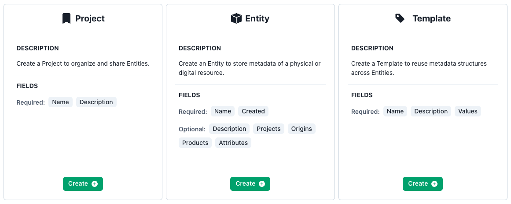

# Creating Metadata

Accessible from the navigation menu, the "Create" portal provides a pathway to creating Entities, Projects, or Template Attributes from one location.

## Creating Entities, Projects, and Attributes

For each item, the required and optional fields are specified. Further documentation can be found via the pages listed below.

Creating Entities: [Documentation](../Creating-Entities)

Creating Projects: [Documentation](../Creating-Projects)

Creating Template Attributes: [Documentation](../Creating-Templates)

## Creating Workspaces

Workspaces are managed separately to Entities, Projects, and Template Attributes. Workspaces are created and managed via the Switcher present at the top of the navigation menu. Further documentation can be found via the pages listed below.

Creating Workspaces: [Documentation](../Creating-Workspaces)
