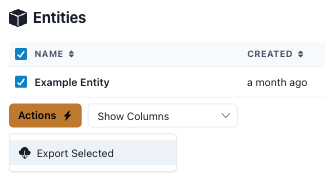
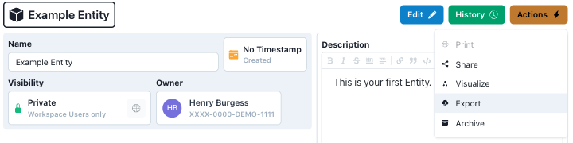
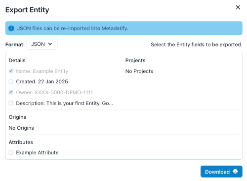
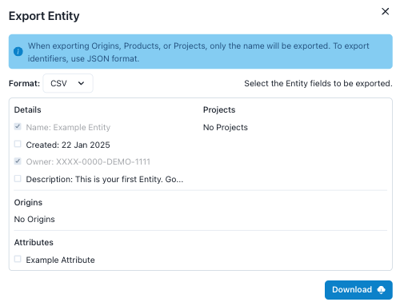
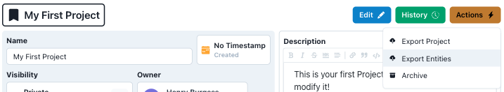

# Exporting Data

Metadatify provides the capability to export data into multiple file formats.

## Exporting Entities

There are several ways to export Entities, depending on the Entity's context and desired file contents.

### Exporting Entities - Entity List

Selecting an Entity (or Entities) from the list of Entities will enable the "Export Entities" button under the yellow "Actions" menu.

This will generate a JSON file containing the metadata of the selected Entity or Entities.

### Exporting Entities - Entity View

Individual Entities can also be exported from the Entity View.

The modal will present a set of checkboxes to select the data that will be be exported. The file format can also be selected.

Exporting in JSON format:

Exporting in CSV format:

After selecting the data and file format, select "Download" to generate the file and download it.

### Exporting Entities - Project

The "Export Entities" button is also available under the yellow "Actions" menu from the Project View.

This will generate a JSON file containing the metadata of all Entities in the Project.
