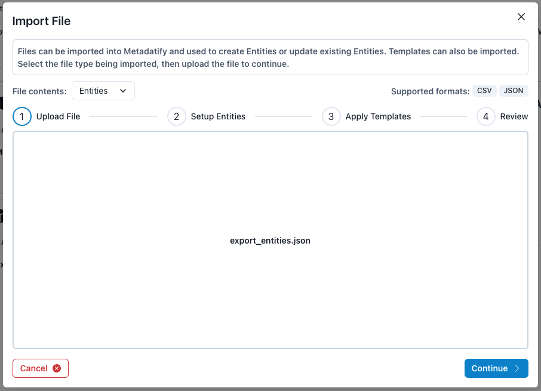
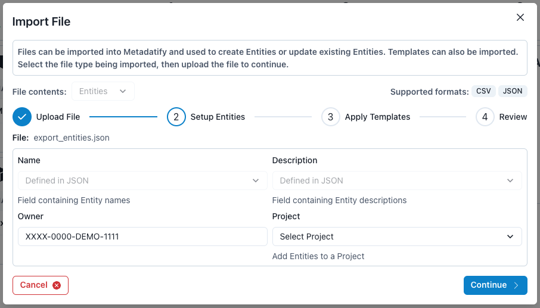
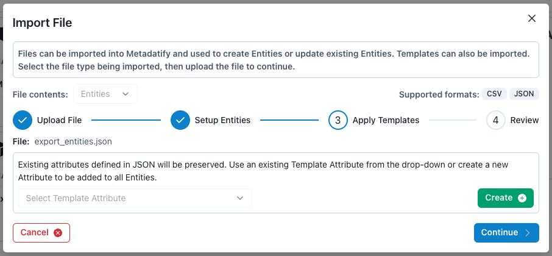
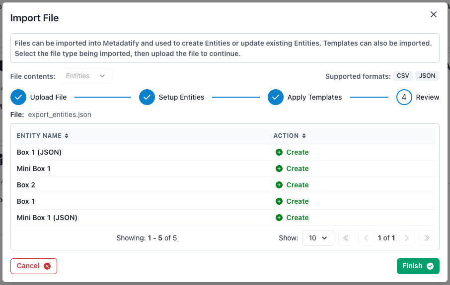
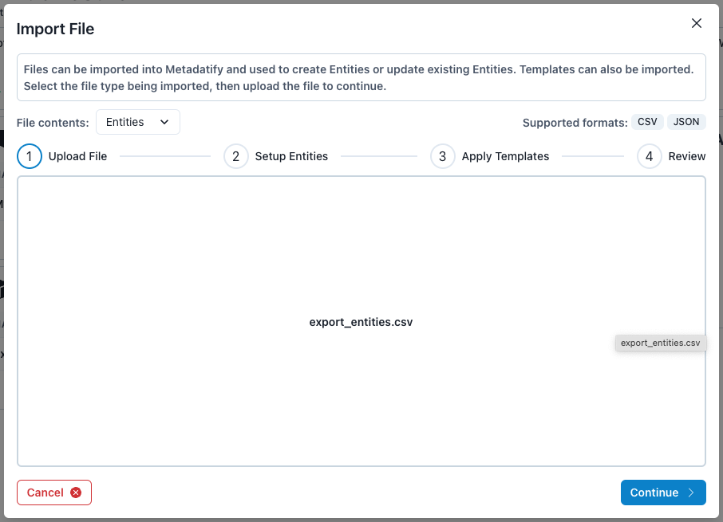
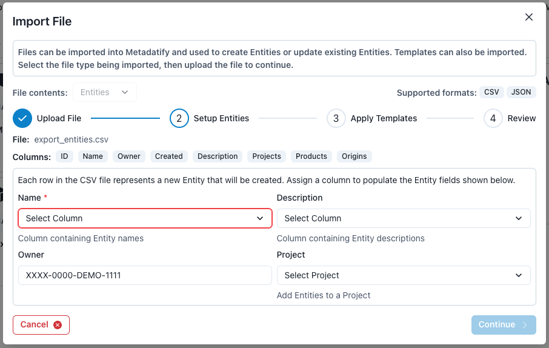
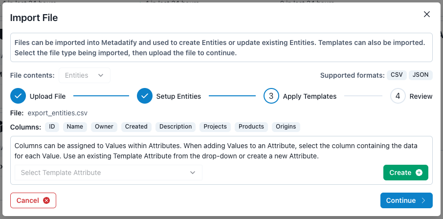
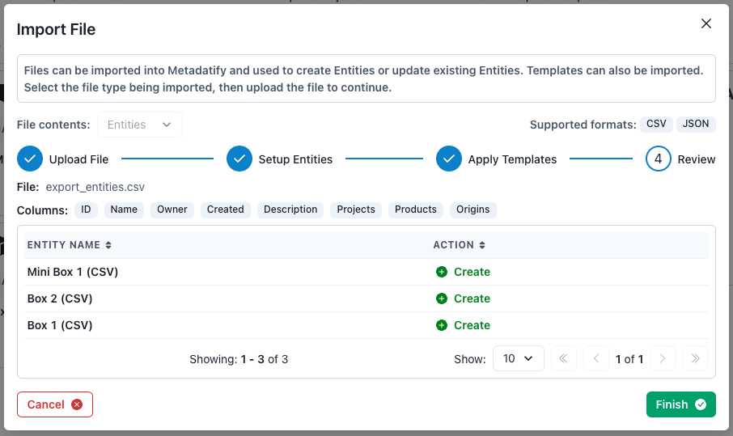

# Importing Data

Metadatify provides the capability to import data using multiple file formats. Currently, two file types are supported: JSON and CSV files.

## Importing JSON Files

When importing JSON data, two file structures are supported: single-Entity imports, or multi-Entity imports.

### Importing JSON Files - Single-Entity Imports

Single-Entity imports only contain data for a single Entity, and are structured as below:

```json
{
  "_id": "eDDyDMjQ",
  "archived": false,
  "name": "Box 1",
  "owner": "XXXX-1234-ABCD-0000",
  "created": "2023-12-27T20:12:43.686Z",
  "description": "This is a Box that fits inside another Box.",
  "projects": ["pBwj_re8"],
  "relationships": [
    {
      "target": {
        "_id": "eqRN9NBH",
        "name": "Box 1"
      },
      "source": {
        "_id": "eDDyDMjQ",
        "name": "Box 1 (JSON)"
      },
      "type": "child"
    }
  ],
  "attributes": [
    {
      "_id": "a-eDDyDMjQ-SLaiM7",
      "archived": false,
      "name": "Example Attribute",
      "description": "Attribute description",
      "values": [
        {
          "_id": "v_text_18319",
          "name": "Text Value",
          "type": "text",
          "data": "Example value"
        }
      ]
    }
  ],
  "attachments": []
}
```

There are multiple requirements and considerations when importing a Single-Entity file:

- If the `_id` field is not specified or does not exist, it will be ignored and a new Entity will be **created**. If the `_id` field corresponds to an existing Entity, that Entity will be **updated**.
- The `owner` field will be reset to the ORCiD of the user uploading the file.
- If any identifier in the `project` array does not exist, that Project membership will be skipped.
- Even if a target Entity within the `relationships` array does not exist, the relationship will still be created. The non-existent Entity will be displayed as disabled and inaccessible.
- Ideally, all fields should be specified in the JSON file. Else, default values will be specified. The following fields are expected: `_id`, `archived`, `name`, `owner`, `description`, `projects`, `relationships`, `attributes`, `attachments`.

A default Entity JSON file is shown below:

```json
{
  "_id": "ENTITY_ID",
  "archived": false,
  "name": "Entity Name",
  "owner": "XXXX-DEMO-1111-0000",
  "created": "2000-01-01T00:00:00Z",
  "description": "Entity Description",
  "projects": ["PROJECT_ID"],
  "relationships": [
    {
      "target": {
        "_id": "TARGET_ENTITY_ID",
        "name": "Target Entity Name"
      },
      "source": {
        "_id": "ENTITY_ID",
        "name": "Entity Name"
      },
      "type": "parent"
    }
  ],
  "attributes": [
    {
      "_id": "a-ENTITY_ID-ATTRIBUTE_ID",
      "archived": false,
      "name": "Entity Attribute",
      "description": "Entity Attribute description",
      "values": [
        {
          "_id": "v_text_VALUE_ID",
          "name": "Example Value",
          "type": "text",
          "data": "Example Value"
        }
      ]
    }
  ],
  "attachments": []
}
```

### Importing JSON Files - Multi-Entity Imports

Multi-Entity imports contain data for multiple Entities, and are structured as below:

```json
{
  "entities": [
    {
      "_id": "ENTITY_ID"
      // ... Entity data
    }
  ]
}
```

These are essentially a collection of Entity objects, contained within a list under the `"entities"` key. Metadatify then treats each Entity contained within this list as if it is a single-Entity import, meaning it applies the same logic when deciding to create or update the Entity to each given Entity.

### Importing JSON Files - Steps

#### Step 1



Click the blue "Import" button located under the "Tools" heading on the navigation bar to open the import modal. Ensure "Entities" is selected as the "File contents". Browse or drag and drop a JSON file into the field, and click "Continue".

#### Step 2



The _Name_ and _Description_ of each Entity is fixed and specified in the JSON file itself and cannot be updated through the import process. By default, the _Owner_ is set to the user who is currently importing the JSON file.

The _Project_ drop-down menu presents a list of all Projects in the current Workspace. If a Project is selected, every Entity being imported will also be added to the selected Project.

#### Step 3



When importing Entities via JSON files, additional _Attributes_ can be added during the import steps. Use the green "Create" button to create a new Attribute or select an existing Template Attribute. The Attributes from this step will be added to all Entities as they are imported.

#### Step 4



Finally, review all Entities before completing the import process. This screen presents a table listing the Entities being created or updated. Use the green "Finish" button to finalize the import process.

## Importing CSV Data

> CSV files can only be used to create Entities and cannot be used to update Entities.

There are two requirements when importing CSV files:

1. The file contains a header row.
2. The file contains at least 1 column, with at least one non-empty non-header row.

Metadatify will extract the columns in the CSV file and present them to be assigned to specific Entity fields.

For example, the `description` column in a CSV file could be assigned to populate the `Description` field within each Entity.

### Importing CSV Data - Steps

#### Step 1



Click the blue "Import" button located under the "Tools" heading on the navigation bar to open the import modal. Ensure "Entities" is selected as the "File contents". Browse or drag and drop a CSV file into the field, and click "Continue".

#### Step 2



The list of all columns in the CSV file are displayed above the Entity fields. These columns can be mapped to Entity fields, hence why at least one column is required to populate the Entity _Name_.

The _Name_ and _Description_ of each Entity can be mapped to columns within the CSV file. To map a column to an Entity field, click the column name from the drop-down associated with that field.

Each data row in the CSV file will correspond to a new Entity. By default, the _Owner_ is set to the user who is currently importing the CSV file.

The _Project_ drop-down menu presents a list of all Projects in the current Workspace. If a Project is selected, every Entity being imported will also be added to the selected Project.

#### Step 3



When importing Entities via CSV files, additional _Attributes_ can be added during the import steps. Use the green "Create" button to create a new Attribute or select an existing Template Attribute.

Similar to Step 2, the data field in each Value comprising the Attribute must be mapped to a column in the CSV file. The Attributes from this step will be added to all Entities as they are imported.

#### Step 4



Finally, review all Entities before completing the import process. This screen presents a table listing the Entities being created or updated. Use the green "Finish" button to finalize the import process.
